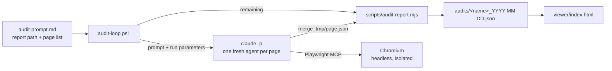

# RGAA Auditer

Automated [RGAA 4.1.2](https://accessibilite.numerique.gouv.fr/methode/criteres-et-tests/) accessibility audits of a list of web pages. A PowerShell loop starts one headless Claude Code agent per page; each agent drives Chromium through the Playwright MCP server, evaluates the 106 RGAA criteria of its page and merges the result into one shared JSON report. A single-file viewer then lets you review the report, track fixes and copy prompts for a coding agent.

Nothing is fixed on the audited site: the report is the only output.

## How it works



1. You copy `audit-prompt.example.md` to `audit-prompt.md` and write the report path and the page list in it.
2. `audit-loop.ps1` asks `scripts/audit-report.mjs remaining` which pages are not in the report yet, then starts `claude -p` for the first of them. The agent receives the prompt followed by a run parameters section: target URL, report path, page file, pinned `@playwright/mcp` version and merge command.
3. The agent audits that page only. It evaluates every criterion with the method fixed for it, writes its result to `.tmp/page.json` and runs the merge command. The merge validates the page against the contract and appends it to the report, which the first page creates.
4. The loop waits for the next interval, then starts the next page, until every page is in the report.
5. You load the report in `viewer/index.html`.

The agents never see each other: each run starts from an empty context and shares nothing with the others but the report. Each run gets the prompt only (no auto memory, no `CLAUDE.md`, no claude.ai connectors) and only the Playwright MCP server. Each run waits up to 30 seconds for that server to connect before the agent starts (`MCP_CONNECT_TIMEOUT_MS`; Claude Code waits only 5 seconds by default, which a slow `npx` start exceeds). Runs are sequential.

## Requirements

- Windows with Windows PowerShell 5.1 or PowerShell 7.
- [Node.js](https://nodejs.org/) 20 or later, for the report script, the tests and `npx`, which starts the Playwright MCP server.
- [Claude Code](https://code.claude.com/) CLI, logged in. Tested with version 2.1.206.
- The Chromium build of the pinned `@playwright/mcp` version. With the version of `audit.mcp.json` (currently 0.0.83), install it once with:

  ```powershell
  npx @playwright/mcp@0.0.83 install-browser chromium
  ```

- For the viewer: a Chromium-based browser and an Internet connection (two libraries come from a CDN).

## Prepare an audit

1. Copy the prompt template:

   ```powershell
   Copy-Item audit-prompt.example.md audit-prompt.md
   ```

2. In `audit-prompt.md`, edit the two parameter blocks:
   - `audit-report`: the report path, `audits/<name>_YYYY-MM-DD.json`. The final date is the audit date. Use a new path for each audit: a page is audited only once per report.
   - `audit-pages`: the pages to audit, one absolute URL per line, in audit order.
3. Check the parameters; this prints the report path and the pages left to audit:

   ```powershell
   node scripts/audit-report.mjs remaining --prompt audit-prompt.md
   ```

`audit-prompt.md` is ignored by git. Each run reads it again, so an edit applies from the next page on.

## Run the audit

```powershell
.\audit-loop.ps1                        # one page every 30 minutes
.\audit-loop.ps1 -IntervalMinutes 0     # pages one after the other, without waiting
.\audit-loop.ps1 -MaxFailures 3         # tolerate more failed runs per page
```

If script execution is disabled on the machine, run `powershell -ExecutionPolicy Bypass -File .\audit-loop.ps1`.

- **Cadence**: `-IntervalMinutes` is the time between the starts of two runs; a long run shortens the next wait. The loop stops as soon as no page is left.
- **Outcome of a run**: after each run, the loop reads the report again.
  - The page is in the report: next page.
  - The agent answered `ENVIRONMENT_ERROR` (MCP server not loaded, browser missing, run parameters missing): the loop stops. Fix the environment, then start the loop again.
  - Claude Code itself failed (non-zero exit code, error result or no JSON result, for example when a usage limit is reached): not counted against the page, which is retried at the next run.
  - The run ended normally without merging the page: counted against the page. After `-MaxFailures` such runs (2 by default), the page is skipped until the next launch.
- **End**: the loop lists the skipped pages, if any, and exits with code 1. Starting it again resumes from the report and retries them.
- **Pages that cannot be audited** (HTTP error, timeout) are merged as not audited, with the reason, and not retried.
- **One loop per report**: never run two loops on the same report at the same time.
- **Stop**: Ctrl+C. Unless its agent had already run the merge, the page being audited is not in the report and is audited at the next launch.

`audit.log` (ignored by git) keeps one block per run: the target page, the Claude Code result (subtype, turns, duration, cost), the permission denials, the agent's answer and the outcome.

### What the agents are allowed to do

The loop runs `claude -p` with `--permission-mode dontAsk`: every tool call that is not explicitly allowed is denied without asking. Allowed:

- the tools of the Playwright MCP server declared in `audit.mcp.json` (`--strict-mcp-config` ignores every other MCP server), except `browser_run_code_unsafe` and `browser_file_upload`;
- among the built-in tools, only `Read`, `Write` and `Bash`, with writes allowed to the page file only and the merge command allowed in Bash.

The agents run in `.tmp/`, which the loop empties before each run; the run parameters give them paths relative to it (`page.json`, `../audits/…`). `.tmp/` is also the workspace root of the Playwright MCP server: the files an agent saves with a Playwright tool (screenshots, snapshots) land in it or in `.tmp/.playwright-mcp/`, and the server rejects a file path outside it, so the agents cannot write to the repository through the browser tools.

The allow and deny rules of your own Claude Code settings still apply on top of this list. A permission denial appears in `audit.log`: it usually means a tool the agent needed is missing from the list.

The agents browse with a headless Chromium and an in-memory profile: no cookie or consent is carried from one page to the next. They refuse cookie consent, trigger form validation without ever submitting a form, and never modify the audited site.

## Review the results

Open `viewer/index.html` in a Chromium-based browser (double-clicking works) and drop the report on it. See [docs/viewer.md](docs/viewer.md).

To check a report against the contract:

```powershell
node scripts/audit-report.mjs validate --report audits/<name>_YYYY-MM-DD.json
```

## Repository layout

| Path                                           | Content                                                                                    |
| ---------------------------------------------- | ------------------------------------------------------------------------------------------ |
| `audit-prompt.example.md`                      | Audit prompt template, copied to `audit-prompt.md`                                         |
| `audit-loop.ps1`                               | Audit loop                                                                                 |
| `audit.mcp.json`                               | Playwright MCP server of the audit runs: pinned version, headless and isolated Chromium     |
| `scripts/audit-report.mjs`                     | Report command line: `remaining`, `merge`, `validate`                                      |
| `scripts/report.mjs`                           | Report library used by the command line                                                    |
| `docs/audit-format.md`                         | Contract of the report and of the page submissions                                         |
| `docs/audit.schema.json`                       | JSON Schema of the report                                                                  |
| `docs/rgaa-criteria.json`                      | The 106 criteria with their canonical topic, title and method                              |
| `docs/viewer.md`                               | Viewer documentation                                                                       |
| `viewer/index.html`                            | Viewer                                                                                     |
| `scripts/*.test.mjs`, `viewer/viewer.test.mjs` | Tests                                                                                      |
| `audits/`                                      | Reports (ignored by git)                                                                   |
| `.tmp/`                                        | Working directory of the agents, emptied before each run (ignored by git)                  |
| `audit.log`                                    | Log of the runs (ignored by git)                                                           |

## Development

`npm test` runs all the tests with the Node.js test runner; there is no dependency to install. [CLAUDE.md](CLAUDE.md) lists what must stay consistent across the prompt, the criteria list, the schema, the script and the viewer.
